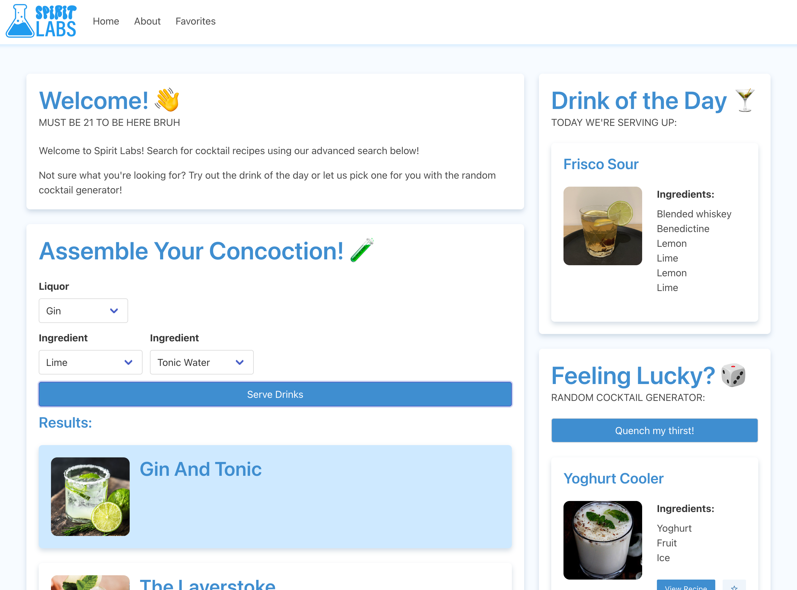

## Description

Spirit Labs is a cocktail search tool for finding the perfect drink for your taste buds. Search for the classics or something brand new - Spirit Labs has it all.

- Fueled by poor experiences scouring the web for cocktail recipes and getting lost on mile-long recipe blogs, Spirit labs was created as an easy & lightweight way to discover new drinks or find recipes for your tried and true favorites.

- Can't find the recipe you used last time out of the web? Don't quite know what you're looking for and kind find your desired results? Let Spirit Labs handle the searching for you.

## Usage

### [ACCESS GRANTED: ENTER SPIRIT LABS HERE](https://abealberts.github.io/spirit-labs/)

Start the search for your next favorite cocktail with the following features:
- Search for cocktails using up to three ingredients
- Get a Drink of the Day recommendation every 24 hours
- Get served something new with the random cocktail generator
- (Future Development) Save your favorite recipes to access them at a moment's notice
- (Future Development) View more details and instructions for cocktails with a click

### Screenshot:

## Credits

Spirit Labs is powered by [TheCocktailDB](https://www.thecocktaildb.com/api.php)

